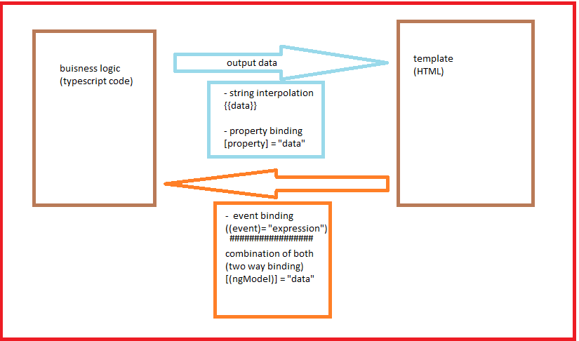

# Angular tutorial

basically angular is used to create the single page application
so following will be the excution flow of the app
the flow off the app is as follows :-

## fundamentals

1. it will run main.ts
   in main.ts there is a single line

   ````ts
    platformBrowserDynamic().bootstrapModule(AppModule)
   .catch(err => console.error(err)); ```
   ````

   so in above snippet there is AppModule which spacifies our app module which has all our app component registry which in built or user defined components we need are present in the app module file

2. from the main.ts file the app module is getting excuted
   the angular uses components to render but uses modules to bind components together

```ts
@NgModule({
  // declarations has the registry of components
  declarations: [AppComponent, AlertComponent],
  imports: [BrowserModule],
  providers: [],
  bootstrap: [AppComponent],
})
export class AppModule {}
```

the module is an ordinary typescript class which has **_@NgModule_** directives
this class has basic properties like declarations, imports, providers, bootstrap

    1. declaration : this property takes an array which uses the components of the app to register (for Components see point 3)
    2. imports : imports contains the inbuilt anguler modules which are used in app
    3. providers : this is used for dependancy injection
    4. bootstrap : this containts the only one component which has selector this one component selector is ingested in index.html
                    there is only one component which can be used in this array

3. Components
   components are basic building block of the app this components has basic syntax

```ts
@Component({
  selector: "app-root",
  templateUrl: "./app.component.html",
  styleUrls: ["./app.component.css"],
})
export class AppComponent {}
```

component is also a basic class which has **_@Component_** directive
this class will provide the basic buisness logic and class structure to the component
[NOTE] while delaring the class name of component we should use the CamelCase for class name

the component should be have basic two methods to create
i. manually creating the files
ii. by using cli

i. manually creating files :-
we need to create the components file which will be class and component directive
so the file name should contain fileName.component.ts > ex. **_server.component.ts_**
[NOTE] for each component always create a seprate folder.

then in that file create the class with the camelcase in name.
now import the Component directive from @angular/core.
as shown in above snippet add the properties in component

so there will be main 3 properties in component

            1. selector : this is used as the name of the component which we can be used in the html file
            ex. <selctor-which-we-have-defined></selctor-which-we-have-defined>
            2. templateUrl : this will take the html template file path
            2.1 template : this will take the html template as whole we can give any html template to it as
            example. '<div>shubham</div>'
            3. styleUrls : this will take the style file path or any other url
            3.1  styles : this will take the styles css objects array which will be applied to the component [both should be array]

while using the template or styles property we can write the single line templates with _''_ and _""_
for multiple line template we can use _``_ as in javascript

the template property is used when there is small html code which we dont need to put in seprate template

note : the template url or template tag one of them is necessary for the component (one of them should be present in the component file)

so basically component class file contains the basic information about the component how data is processed logic and which html template we need to use and which style file we need to use

selector should be new and unique for each component so injection of any component into the perticular file is defined by that
ex. app-server
[IMP]
to configure our component we need make some changes in app.module.ts file (by defualt in angular created project)
so in declaration property of the app.module.ts file of @NgModule directive we need to add the class name of the component as it is in camel case else the angular will not know the which component on the selector

we can use selector tag to insert the component into the html file
ex. <app-server></app-server>

ii. creating with cli :-
use the following command which will automatically create the component

```shell

ng generate component ComponentName

```

shortcut of the command

```shell

ng g c nameOfComponent

```

generate : this key word in the command is used for generating many things
this command will genrate the component related all files and register the component in the module

in component there is one property as we discussed named as templateUrls
there is also the template property which is alternative for the templateUrl

so the basic file compilation will be as

main.ts --> app.Module.ts --> app.component.ts --> html template (app.component.html)

## selector property

the basic syntax we can use with selector in differnt templates in different ways
basically in component file we declare the selector as 'selector-name'
but according to the use of selector we can use it as class or attribute
only the syntax in component file will change and the syntax in template will also change
with the defualt syntax we can just have the selector as tab ex. <selector-name>

#### using selector as attribute

description : so basically the html tag has so many attributes few of them are style class etc.
ex. <div style={}></div> here style is used as attribute

so as above statements stats that as long as we declare selctor in string then we can use it as the

so use selector as attribute we have to use it in the syntax as

```ts
selector: "[selector-name]";
```

and in html template we can use it as

```html
<div selector-name></div>
```

so the selector name is used as the attribute in above html template
so in dev the template will get rendered

#### using selector as class

description : the html tags also has a class
so we can use our selector as class name also

so the syntax is as follows
so to give the selector as class property we need to prefix the selector name with " _._" (dot/fullstop)

```ts
selector: ".selector-name";
```

and to use it in html there is another syntax as follows

```html
<div class="selector-name"></div>
```

## Data Binding

data binding is communication between html template and buisness logic class



summary :-

1. one way binding

output from ts to html

- string interpolation
  ex. {{data}}

- property binding
  ex. [property] = "data"

input html to typescript

- event binding
  ex. (event) = "expression

2. two way binding
   (combination of output and input)
   [(ngModel)] = "data"

### 1. string interpolation

string interpolation is used to show dynamic strings on the html template
so there are few basic rules to follow

            **_rules_** : -
                  1. in string interpolation we can use anything which returns string or which converts end results into the string ( we can use functions as well which returns string)
                  2. we can not use multiline code, if-else and flow controllers like for loop, switch cases etc.
                  3. we cam use ternery expression though
                  4. for function in string interpolation use () as well ex. {{function_name()}}

- basic flow :-
  **_step 1_** :
  in component file we have to declare and assign to variable which will define the string
  ex.

  ```ts
  @Component({
    selector: "app-root",
    templateUrl: "./app.component.html",
    styleUrls: ["./app.component.css"],
  })
  export class AppComponent {
    // declaring the string whose variable names will be used in string interpolation data binding
    varaibleName: "data";
    // declaring the function which will return the string
    functionWhichReturnString() {
      return "string";
    }
  }
  ```

  **_step 2_** :
  in template file we can have the syntax as follows
  in template file we have to use the variable and function name is string interpolation

  ```html
  <div>{{variableName}} {{functionWhichRetutnString()}}</div>
  ```

  there is also we can use one thing we can use string as well in string interpolation
  ex.

  ```html
  <div>{{'string which will render as it is due to quotes'}}</div>
  ```

  we can use both ' ' or " "

### 2. property binding

      basics : - when page gets loaded in the browser the respactive dom get loaded browser converts the dom into tree of elements(tags)
                each elements has several properties
                example.
                 <Button disabled></Button>
                 here disabled is property on button tag

so lets get to it so we can change the behaviour of dom with the help of the property binding
to bind any property with the dynamic data we use the property binding

so there are few steps we need to follow :-
**_step 1_** :
in component.ts file we need few things

```ts
@Component({
  selector: "app-root",
  templateUrl: "./app.component.html",
  styleUrls: ["./app.component.css"],
})
export class AppComponent {
  // so we need constructor for the class the constructor will get loaded once the component is rendered in the browser
  // in constructor will add timeout method which will change the varaible after some time

  // lets declare the varaible which defines as boolean which will be used to disable or enable the button
  buttonState = false;

  constructor() {
    setTimeOut(() => {
      this.buttonState = true;
    }, 2000);
    // this will change the variable to true after 2000 ms
  }
}
```

**_step 2_** :
we need to use the variable as property binding in our html template as follows

```html
// the disabled is already existing property on the button tag the format of the property binding is easy as property should be in square brackets '[ ]' the value we need to implement in the " " double qoutes

<button [disabled]="!buttonState"></button>

syntax : - [property] = value to the property
```

**_Note_** :-

1. we can bind many properties from html elements
2. also for directives and component we can bind the properties
3. we use the angular cause it changes template (dom/rendered component at runtime) very easily
4. if we are binding any string then the syntax should be as [property] = "'string'" and to avoid this we can simply us as property = 'string';

**_when to use what?_**

- when you want to display a text or something use string interpolation
- when you want to change some property use property binding

### 3. Event Binding

we can bind any event occured in dom with event binding
following are the steps to follow for event binding :

**_step 1_** :
in component.ts
create function which will excute when the event occurs

```ts
@Component({
  selector: "app-root",
  templateUrl: "./app.component.html",
  styleUrls: ["./app.component.css"],
})
export class AppComponent {
  stringToChange = "first String";

  constructor() {}
  // this function will be excuted on the button click
  functionWhichWillChangeTheStringOnClick() {
    this.stringToChange = "second String";
  }
}
```

**_step 2_** :
using the syntax of event binding we can bind any event in the template
Syntax => (event)= "expression or function call"

```html
// we are using the string interploation to show the string variable
<p>{{stringToChange}}</p>
// to event occure will add the button when it is clicked the click event is occured so will bind that event change the string
<button (click)="functionWhichWillChangeTheStringOnClick()">Click Me To Change The String</button>
```

so in above example when button gets clicked the string will be get changes from "first string" to "second string"

[NOTE] :

- we can bind each and every event
- we need to remove the prefix "on" from the event name
  ex. basically the event on button is "onClick" so while using in the event binding syntax we need to remove 'on' from the event
  (click)=> "function()"
- we can any expression or typescript code in " " (double qoutes)
  ex. (click)=> "Code in typeScript or expression in typescript"

### 4. two way binding

the two way binding uses the three types of data binding string interpolation, property binding, event binding.

we are taking the basic example which will show the draw back of the basic two way binding

steps :-
**_step 1_** :
in html template we can declare the the event binding and string interpolation
ex.

```html
<input type="text" (input)="onInputChangeFunction($event)" />
// this $event is the reserved keyword which will use to pass the event into the function and the input is the event that already exists in file
<p>{{inputText}}</p>
// input text variable is declared in component.ts file
```

**_step 2_** :
in component.ts file we need to handle the event occured on template and set value to variable inputText which will be shown under the box

```ts
@Component({
  selector: "app-root",
  templateUrl: "./app.component.html",
  styleUrls: ["./app.component.css"],
})
export class AppComponent {
  // this will be the input text
  inputText = "";

  constructor() {}
  // this function will excute on the input event is trigger
  // so for the event we need to spacify the type of event as HtmlInputElement else the typescript will throw the error
  // there is already present Event type for the typescript
  onInputChangeFunction(event: Event) {
    this.inputText = (<HTMLInputElement>event.target).value;
  }
}
```

this will basically take the text as input and will print under placeholder

- **_DrawBack_** :-

- this above method has one draw back that it will change the variable when we change it from input placholder or we change variable internally but only the value under the placeholder that we represented in paragrap as string interpoletion will change but not in the place holder
- place holder will remain unchanged regarding the changes in variable
- this will act as the one side data binding

to overcome this drawback we need to go through the advanced method which uses the forms module of angular
**_step 1_** :
so first we need to import forms module in app.module
as we seen earlier in imports array of @ngModule will need to add the
example

```ts
  import { FormsModule } from @angular/forms // imported from the angular/forms module
@NgModule({
  // declarations has the registry of components
  declarations: [
    AppComponent,
    AlertComponent
  ],
  imports: [
    BrowserModule,
    FormsModule // this module we added here so it can be easily use in app
  ],
  providers: [],
  bootstrap: [AppComponent]
})
export class AppModule { }

```

**_step 2_** :
so for two way binding there is simple way
in html template we need to use ngModel directive which will give the two way binding

ex.

```html
<input type="input" [(ngModel)]="TextToChange" /> // text to change is the variable that is already have been declared in the component.ts file
```

and in component.ts file we just need to declare the string nothing more than that. no function to handel the event is required
ex.

```ts
@Component({
  selector: "app-root",
  templateUrl: "./app.component.html",
  styleUrls: ["./app.component.css"],
})
export class AppComponent {
  // this will be the text will change with ng-model directive of forms
  TextToChange = "";

  constructor() {}
}
```

[Examples Repo for data binding](https://github.com/shubhamJawale/DataBinding)

## Directives

basically the directives are use to modify and controll the structure of the dom
there are three types of directives

1. component directives => these are user defined directives it is similar as component with template
2. structural directives => these attributes are use to manipulae the DOM
3. attributal directives => these attribute are use to add the style to the app

component are directives but with template

### Component Directives :

we can define the our own directives
we can use directive attribute define our own directive

example

```ts
@directive({
  selector: "[directive-selector]",
})
export class directiveName {}
```

### Structural Directives

[NOTE] : before every structural directive there we need to use **_"\*"_**
ex. *ngIf, *ngFor etc.

1. NgIf Directive
   ngIf is structural directive that means it changes the dom on run time lets see how to use it
   ex. :-

**_step 1_**
in html template the main changes are

```html
<p *ngIf="variableName"></p>
// this will show the paragraph if variableName is true //
<p *ngIf="functionWhichReturnsBoolean()"></p>
//in here the we can call function also and single variable also which can return boolean
```

**_step 2_**
in component.ts file

```ts
functionWhichReturnsBoolean(){
  return true;
}

// OR

let variableName = false;
```

the paraghtaph will appear when the variable name becomes true
it is not hiding anywhere in the dom it is simply just not there

- ng if with else condition
  basically there is no direct directive to impliment the else condition so we can just use ngTemplate
  example :-

**_step 1_** :
create a ng template and assign a local marker to it this will be act as the identity of the template

ex.
in html file

```html
<p *ngIf="variableName">containt</p>

//ng template example is as follows
<ng-template #anyName> contain // we can use any html code here </ng-template>
// here # is called as local marker, we can assign any name as per our requirements.
```

to identify the ng-template we are using the local marker i.e. **_#_** sign and we can assign any name to it that should be unique

**_step 2_** :
include else in existing ng if

```html
<p *ngIf="variableName ; else anyName "></p>
//her the to end the if statement we can use ; and after else keyword we can use the local identifier name // remember the else part should be in double qoutes of ngIf
```

this will simply load the else part i.e. the template which we have defined whenever the else condition is get true;

2. NgFor Directive
   this is also a structural directive thats why we use \* as the prefix for it.

- ng for is used for looping the html element or user defined component in the template

steps to impliment :-
**_step 1_** :
we can add the ng for on the element or tag we want to loop
syntax :-

```html
<p *ngFor="let element of ArrayDeclaredInComponentFile">containt2</p>
```

- getting index in ngFor
  ex.

```html
<p *ngFor=" let element of anyArray ; let varaible = index">containt2</p>
```

in the above snippet the ; colon shows the end of the for loop expression
[imp] the index is predifined keyword for the ngFor loop this will assign the index to the varible and we can acces it through accross the element

### Attributal Directives

this directives are only used to change the element they were placed on

1. ngStyle attribute directive
   it act as property binding
   so the directive has to property binded to any property

- syntax as follows
  i. we can add ng style attribute on any html tag for styling
  ii. this will provide us with the dynamic code which will help in dynamic styling

**_step 1_** :
in html template file

```html
<p [ngStyle]="{background-color : anyMethod()  or 'string' }"></p>
```

        in above example there are few points to consider
        1. ng style is an attribute directive so it should be used in [ ] => it should be used as property binding
        2. " "=>in double qoutes we can write any javascript as key value pair object (double quotes will consider as the value for the property)
        3. we can assign object of key value pair as property to the ng style this can contain ternery expression or function which return strings or the strings
        4. with value we can call any string or function from the component.ts file
        5. string should be in single tick as shown in above example

there is syntax to key also
we can give it as 'background-color' or backgroundColor both are accepted but the first one contains **_-_** and thats why it should be in single qoutes **_' '_**.
so basically key should be hypen sepreted - or can be camel case but with hypen sepreted key we should assign ' ' every time

2. ng class attribute directive
   this is also the attribute directive this also works as property binding

so for this also has same syntax but differnt working

example

```html
<li
  [ngClass]="{
    'text-success':person.country === 'UK',
    'text-primary':person.country === 'USA',
    'text-danger':person.country === 'HK'
  }"
>
  {{ person.name }} ({{ person.country }})
</li>
```

          in above example we can see that the basic syntax is same but only for class so
          1. it can take multiple classes as keys which should have there own expression or function or string or js code as value
          2. ng class will tell do we need to attach the css class to the element or not based on the function, expression, string etc.
          3. it can add css class only a certain condition is true

## Advanced topics

### project Based on until now topics

so for the basics we are learned until now  
so project will basically contain following things

- project planning
  name of project :- Book shop

- Features

1. shopping list
2. book read/article read/demo

- Componenets with feature sorted

1. Shoping list

   1. shoping list
   2. shoping list Edit

2. Reading Section

   1. Book List
   2. Book Content/publication house/writer
   3. Book Summary

3. Models
   1. Writers/publication Basic Book details
   2. Book

[Project Repo]('google.com')

> Steps

1. create project
   to create the project we should us angular command line interface
   so if we use shell commands  
   for the basic details pre steps
   1. go to the folder where you want to create project
   2. click on the address bar of the file explorer and clear all and press 'cmd' to open the command prompt for that directory and then follow following steps

to create the project we have basic command

```shell
  ng new ProjectName
```

in our case it would be BookSpace  
so the command will be like

```shell
  ng new BookSpace
```

after this the CLI will Ask if you need angular router in project will need that in future so we will say yes by pressing y
second question will be about the style sheet format it can be anything like css, scss etc. choose which one you are comfortable in.  
we are choosing css.

now it will take some time to get the project created

after it press cd ProjectName in our Case press

cd BookSpace

once you are in the directory of project

**optional**
we are going to use the bootstrap for the project you can choose different css framework
so to install the bootstrap in same directory we came by cd command
so for that we use command

```shell
npm install --save bootstrap@3
```

this will install the dependancy and now we have to configure the bootstrap in our app

press code . to open the project repo in the visual studio code

first go to node modules folder in your app and find the bootstrap folder in it go to dist and then css find file ending with min.css copy the relative path by clicking right.
go to the angular.json file in your project there we have styles array. in that array if there is any entry keep it as it is. by adding comma will ad the reletive path of the css file in the array (the path should be start from node_modules)
example

```js
 "styles": [
              "src/styles.css",
              "node_modules/bootstrap/dist/css/bootstrap.min.css"
            ],
```

so basic project creation is done
in the component creation we need to add the basic components as header and navbar

[NOTE] See the project dir for additional info about project...

## Debugging

so to invoke basic debugging ;-
open the devtools by clicking on inspect in browser
now go to the sources tab then in soruces you can see many bundles
inline.bundle
or
main.bundle
this bundles are our typescript code compiled by angular so we can select main bundle
search for the line or piece of code which you want to debugg once found click on the line number of the code
it will automatically open the ts file for that logic
now you have break point you just need to trigger it from ui then ui can have debugg menu at your hands

this will be tidious task if you are working with lots of code to find the lines in heystack

so now below you have **_webpack://_** in this you can expand and now you have folder structure files as you have in your project
now you can open and add breakpoints anywhere you want

## Advanced Component And DataBinding

there are two types of custom data binding

1. custom property binding :-
   we pass data from the parent to child
2. custom event binding
   we pass data from child to parent

### Custom property binding

all the properties inside the components are only used in component not outside the component
in property binding we pass the data from parent to child

#### @Input() decorator :-

In project repo we have seen everything but still we dont have way to pass the data through on component to another
for example now we have two components 1. todo list and 2. todo task
now we have the main app component which will have the data for the todo list in wich the todo list component will load and also have some buttons
and the to do task component will be loaded in the todo list component so for this operations we need to pass the data from
app component to list component and then from list component to todo task component

Summary of the structure is as follows

1. will have list of lists (list of task Lists)
2. will have list of tasks
3. individual task

so first lets understand how we can pass the data

the data is passed to components by using the @Input() decorative
for example
we have tasklist component as follows

```ts
// todo list component.ts
@Component({
  selector: "app-todo-list",
  templateUrl: "./todo-list.component.html",
  styleUrls: ["./todo-list.component.css"],
})
export class TodoListComponent {
  listElements: Array<{ header: string; data: string }> = [
    { header: "test 1", data: "list 1" },
    { header: "test 2", data: "list 1" },
  ];
}
```

which has list of tags and we have html as

```html
<!-- todo list component.html -->
<div class="container">
  <app-todo-task *ngFor="let task of listElements"></app-todo-task>
</div>
```

now we dont know how to pass the data to the app todo task component now the task component has basic structure as

```html
<!-- todo-task.html -->
<div class="container">
  <h6>{{ task?.header }}</h6>
  <p>{{ task?.data }}</p>
</div>
```

and component file of it as

```ts
//todo task component.ts
import { Component, Input } from "@angular/core";

@Component({
  selector: "app-todo-task",
  templateUrl: "./todo-task.component.html",
  styleUrls: ["./todo-task.component.css"],
})
export class TodoTaskComponent {
  task: { header: string; data: string };
}
```

so now we have property task but it has no data; and also we need to pass the data from the list as task so how we can do that
for that we need to use @input() decoration

this decoration will be used to pass the data in components via properties.

so in above snippets lets pass the task from task list to the task component

so in component file of todo-task we need to add one import as Input from anglur/core

will change the ts file to

```ts
// todo task component.ts
import { Component, Input } from "@angular/core";

@Component({
  selector: "app-todo-task",
  templateUrl: "./todo-task.component.html",
  styleUrls: ["./todo-task.component.css"],
})
export class TodoTaskComponent {
  @Input() task: { header: string; data: string }; // here we have added the task as @Input() so it can be available as property for this component which we can bind
  // this is due to the rule that says all the properties declared in component are not accessible outside the component even though they are not private so to access them from another component we use the @Input() declaration
}
```

now we can bind this task property in taskList component
so in html template of the task-list component we can add as

```html
<!-- todo list component.html -->
<div class="container">
  <app-todo-task *ngFor="let taskElement of listElements" [task]="taskElement"></app-todo-task>
</div>
```

we can give the spacific name to the input also so for that we have syntax as follows
in task component file we can say that

```ts
// todo task component.ts
 @Input('todoTask') task: { header: string; data: string }; // todoTask property is available publically to access along the components
```

example snippet for taskList html is as =>

```html
<!-- todo list component.html -->
<div class="container">
  <app-todo-task *ngFor="let taskElement of listElements" [todoTask]="taskElement"></app-todo-task>
</div>
```

### Custom event binding

basically in custom property binding we have passed the data from parent node to child node;

but now we need to pass the data from child to parent so this will be done in following steps
in child :-

1. create events with EventEmmiter with data and also add the @Output() to make it accessible or emmit the data beyond the component
   example :-

```ts
//chiild.component.ts
@Output eventName : new EventEmitter<{data:"type of the event"}>

//this method will be used emit the event
emittTheEvent(){
  this.eventName.emit({data:"anything You Cnn Pass As A type"})
}

```

2. add method and html to emmit the event

```html
<!-- child.component.html -->
<!-- added the method to emitt the event we just need to assign some thing to cause the event -->
<button (click)="emittTheEvent()">Emit the event</button>
<!-- on click of this button the event will be emited of type given -->
```

in parent :-

1. add listener to read the event emmission

```html
<!-- in parent component.html -->
<childComponent (eventName)=>"DoSomething($event)"></childComponent>
<!-- here in child component we are listening to the custom event we have created -->
<!-- with $event we are passing the event data to the method -->
```

2. add the method handle the event occurence

```ts
// parent.component.ts file
// here we need to add the method to handle the evnet data

doSomething(data : {data: "any data passed through event"}){
  console.log(data.data);
}
```

same @Input we can give the @Output() a parameter to act as the custom or different name than component property example **@Output('differntName')**

DrawBack :-
this can create problem to pass the data between sibling components
this can create complex chains of data binding to pass the data between the siblings

### View Encapsulation :-

view encaspulation is basically applied to the css file which are limited to component it is applied.
explaination :-
basically the css dont understand the limit so it will applied to all child components of the component the css file is applied but angular encapsulates the view that means the css file is applied to the certain components so basically the angular creates it own encapuslation tags ex=> for <p> becames <p_somethingGivenByAngular> so this will apply the css to this paragraph only if we define any css to <p> in component css file.
so there are ways to encapsulate the view :-

in component.ts file
in @Component() decoration we need add one property called as encspulation
ex :

```ts
@Component({
  selector :'',
  templateUrl:'',
  styleUrls :[],
  encapsulation : ViewEncaspulation.Emulated // by defualt it is emulated that will apply view encapsulation
// other option is none will remove view capsulation so the css will be applicable on all over the app
// third option is ShadowDom
   })
```

this will be usefull beacuase of the your css should be applicable to your component only

### usning local refernce in templates

so basically the local refernces can be used on any html element in that template.
so the local refernces are used to reference the html elements in the template.
the scope of the local reference is only available for that comppoent template.

the local refernces can be defined in html tag by using #
so the syntax as follows

```html
<input type="text" name="data" id="" class="m-1" placeholder="taskDetails" #InputData />
<!-- by using # we can give name to local reference-->
<input type="text" name="header" id="" class="m-1" placeholder="task name" #InputHeader />

<!-- and with the local refernce has been set we can pass it to the method wich we are calling on button -->
<button class="btn btn-primary m-2" (click)="addTask(InputHeader, InputData)"></button>
```

in above snippet we can see we have the syntax for the local refernce as **_#LocalReferneceName_**
so the local reference now contains our html tag in above snippet that is input tag element so if we print the local reference
then it will give us the same template code of the taf which we have assigned to local reference

so now in component.ts file we can use the local refernce i.e our html tag as follows

```ts
// we are accepting the htmlInput elements for this method
// we assigned input tags to local refernces in html template and passed them down to the method
addTask(taskHeader: HTMLInputElement, taskData: HTMLInputElement) {
  // console.log(taskHeader)
    this.listElements?.push({ header: taskHeader.value, data: taskData.value });
    // from tag input we need to get the value so we have written as above
  }
```

note : - if we uncomment this part // console.log(taskHeader) in above snippet then the console will be written as => input type="text" name="header" id="" class="m-1" placeholder="task name" #InputHeader />
so the basic understanding is local reference only attach the html tag to that local refernce name => for furter process we need to extract the data

### @ViewChild() :-

so basically we have seen local reference but until now we can just use them only if we pass them. but what if we need to access them in our code without passing to any method

so lets gets to basics
we can use the view child directive of the angular/core. it is used to configure the qurry.
so basic syntax of the viewchild is as follows

@viewChild('selector')
or
@ViewChild(ComponentName)

so basically the viewchild will look for the first element or directive matching the selector in dom

so basically we can use html tag as follows :-

```html
<input type="text" name="header" id="" class="m-1" placeholder="task name" #InputHeader />
```

so to access this local refernce we can use @ViewChild in our ts file

as follows

```ts
  @ViewChild('InputHeader', {static:true}) inputHeader: ElementRef

```

from angular 8+ we use {static : true } if we are going to us it in ngOnInit else we set it as {static : false}
from angular 9+ we only set as true not false it is by defualt false

if we go like this it will not create problem from angular 9+ if we are not using it in ngOnInit()

```ts
  @ViewChild('InputHeader') inputHeader

```

so if we console log the serverContentInput then we can see the type of it as Element Ref
this is the inbuilt angular type which is used to refer a html element as a object or type in angular

so to make it more logical we can assign the type as follows

```ts
  @ViewChild('InputHeader') inputHeader: ElementRef
```

so basically we have reference to that tag element selector i.e. our local reference

now we need to access the data of the elementRef

so for that we have inbuilt property on ElementRef object as **nativeElement**
so this property native Element will access the html native tag i.e input tag in our case

so to access the data now we have access to native html tag so from it we can access the input text via **_.value_**
as given below

```ts
this.inputHeader.nativeElement.value;
```

### ng-content directive in html template:-

so basically now if we are building one component which is dependant on other then we use property binding (custom) to pass data from parent to child.
so the there is alternative to it by using ng-content;

it has basic syntax
in parent html template

```html
<child-component-selctor>
  <p>Any Data</p>
</child-component-selector>
```

so in above snippet of parent html template the <p> tag is added between the opening and closing of the child component selector so by defualt angular will ignore the tag or multiple lines of code.
but if we have to add this data in our child component then we can use ng-content

in child component html template

```html
<h1>header</h1>
<ng-content></ng-content>
<h3>body</h3>
```

so the ng-content will inject the code between the header aand body in above snippet from the parent component html

for real example

```html
<!-- parent template -->
<child-component *ngFor="let anyVaribleName of ArrayName">
  <p>{{anyVariableName.data}}</p>
</child-component>
```

```html
<!-- child html template -->
<h1></h1>
<ng-content></ng-content>
<h3></h3>
```

the above parent component data will be reder at the place of ng-content

summary : we can pass the data through

1. custom property binding using @Input
2. custom event binding using @Output
3. using local refernces #localRefernceaName
4. using @ViewChild and ElementRef
5. using <ng-content>

## Component LifeCycle

there are 8 hooks related to the component lifecycle
so basically from we excuting the code and angular rendering the code to destroy the code we have lifecycle of the component so it has phases so according to 8 hooks we can tap into this phases at any given point

so
note : for all hooks before adding them you need to impliment the hook to component class example as follow

```ts
@Component({})
export class ComponentName implements OnChanges {
  ngOnChanges() {}
}
```

1. ngOnChanges : this hook is called after the input property changes that means if @Input property recieves any change from parent then the ngOnChanges hook get into action or get called
   ng on changes hook recives a param of type SimpleChanges;

as follows:

```ts
import {SimpleChange} from @angular/core
ngOnChanges(changes : SimpleChange){}
```

if we console log the changes variable of type Simple changes
it will print a object with the details of change happend on which @Input property and other details like changed value, is it first change or not, previous value etc.

[NOTE]

i. this is the only hook that takes parameter

2. ngOnInit : this hook is called once the component is initialized basically when it rendered on screen. so the ngOnInit runs after the constructor
   so the precedence is as constructor gets called and then ngOnInit is called

3. ngDoCheck : this will call during any change detection run like button click event and all.
   in devlopement mode the angular has one more check cycle.
   there are couple of changes will trigger this method and event is called by clicking or any event.
   (change detection check)
   it is used in case only if angular doesn't pick any change so we have to tell angular

4. ngAfterContentInit : this hook is called after the (ng-content) has been projected or inititalized in view

5. ngAfterContentChecked : this hook is called every time the project content is checked for change

6. ngAfterViewInit : this hooks is called after the component view (and the child view) has been initialized that means when the component template is properly rendered as view on screen.
   basically the after view in it and ng on init has only one basic difference. ng on init works on component is initilized thats why it does not have the access to html templates or html elements but ng after view init is used then it has the access to html element and html templates because it works after view is initilized.
7. ngAfterViewChecked : this hook is called every time the view (and the child view) has been checked
8. ngOnDestory : this hook is called once the component is about to destroy i.e. before the destroy
   example if any \*ngif code is going to destroyed then the ngOnDestroy hook is called same for component is going to exit from view then it is called.

### @ContentChild :-

so basically with @ViewChild we can access the reference of the child element of the template but if we inject any <ng-content> in html template then we dont have access to it cause the html template code is in another component so to get access to this content element refernce we use @ContentChild

so basic syntax is also same as @ViewChild (for angular 8+ and 9+ also)

```ts
//  in child component.ts
@ContentChild('selectorFromParentTemplateOfNgContent') nameOFVariable : ElementRef;
```

```html
<!-- parent template html -->
<child-component-selector><p #selectorFromParentTemplateOfNgContent>any code</p></child-component-selector>
```

```html
<!-- child template html -->
<p><ng-content></ng-content></p>
```

so now we can access the paragraph of the ng-content via @content child directive.

### userDefined Directive

so basicallly we have two types of directives 1. structural ex. ngIf and ngFor 2. Attributal(style) which has 1 [ngClass] and [ngStyle] directives.
now we can also create the directives as we want to change the element.

so for that we are going to use @Directive() from angular core
so basically the directive we can use in dom.

so to create that we have basic syntax

first we need to create a file for directive as

directiveName.directive.ts as name we use .directive.ts
now in file create a ts class with the camelCase naming example

```ts
export class NameOfTheDirective {}
```

so now add the @directive to the class

```ts
@Directive()
export class NameOfTheDirective {}
```

@Directive will take object as configuration

```ts
@Directive({selector : "[nameOfTheDirectiveSlector]"}) // we are using selector as property selector cause we want to acces it as attribute of the element
```

now in class to access the element of the dom or tag of the dom we need to pass the element ref to the directive so we can have access to it

in constructor of the class we pass the parameter for the ElementRef type of element reference.

example

```ts
@Directive({ selector: "[nameOfTheDirectiveSlector]" })
export class NameOfTheDirective implements onInit {
  constructor(elementRef: ElementRef) {
    // write code to access and change the behavoiur of the element for example as below
    // elementRef.nativeElement.style.background = "orange"; // here we dont have basic access so we will use it on ngOnInit so our class will have the implimentation of onInit interface
  }
  ngOnInit() {
    this.elementRef.nativeElement.style.background = "orange";
  }
}
```

and to inject this directive on any element of dom we need to add the directive in the module file
in declarations array

```html
<p NameOfTheDirective></p>
```

we can create the directive by using angular cli

```bash
ng g d directiveName
# or
ng generate directive directiveName
```

drawbacks : this is not the best practice to use elementRefernce it can be valnaurable

so to overcome this we need to use Renderer

### Renderer

so the renderer we can you use to show the best practice and not directly changing the dom

so the basic syntax is same only the one param in costructor is added.

```ts
@Directive({ selector: "[nameOfTheDirectiveSlector]" })
export class NameOfTheDirective implements onInit {
  constructor(elementRef: ElementRef, renderer: Renderer2) {}
  ngOnInit() {
    // so basically renderer provides some basic in built methods to handle some scenarios like styling.
    this.renderer.setStyle(elementRef.nativeElement, "background-color", "red"); // it also takes 4th param which are the renderer flags
  }
}
```

### @HostListner

so basically to make the directive more interactive we can use hostlistener directive
so with hostListner directive we can listen to the hosts event and make some changes on it so for example we can have the text change the colour when we hour over it or we can just make it tranperent as mouse leaves

example of that is as follows

```ts
@Directive({ selector: "[nameOfTheDirectiveSlector]" })
export class NameOfTheDirective implements onInit {
  constructor(elementRef: ElementRef, renderer: Renderer2) {}

  // so here we can hostlistner to two events
  //1. mouseenter
  //2. mouseleave
  // so basically the syntax of the @hostlistener is as
  // @HostListener('DOMEvent') methodName(eventData : Event){ code for excution}
  // so in params of the hostlistner we can add the  dom events which are predifined
  @HostListener("mouseenter") mouseOver(eventData: Event) {
    this.renderer.setStyle(elementRef.nativeElement, "background-color", "red");
  }

  @HostListener("mouseLeave") mouseLeave(eventData: Event) {
    this.renderer.setStyle(elementRef.nativeElement, "background-color", "transperent");
  }

  // we can bind the host listener to any event and also we can make use of eventData in case of custom event binding
}
```

### @HostBinding

so in above case we have used renderer but there is another way much simpler and easier to bind the event

so in this case we use @HostBinding to bind with dom element property so the basic syntax is simple as

@HostBinding('nameOfThePropertyWithProper') variableName : type = initialValue; and we can change this value on our events as follows

```ts
@Directive({ selector: "[nameOfTheDirectiveSlector]" })
export class NameOfTheDirective implements onInit {
  constructor(elementRef: ElementRef, renderer: Renderer2) {}
  @HostBinding("style.backgroundColor") backgroundColor: string = "transperent";
  // so basically here the dom element has style property on which the background color property exists but it should be in camalCase cause the dom knows it as in camelCase

  @HostListener("mouseenter") mouseOver(eventData: Event) {
    //now in here on the event occurs we can just change the property background color
    this.backgroundColor = "red";
  }

  @HostListener("mouseLeave") mouseLeave(eventData: Event) {
    this.backgroundColor = "transperent";
  }
}

// with Hostbinding we can bind to any property the directive seeting on
```

so to understand lets make it more dynamic

basically the custom property binding and custom event binding can be used in our custom directives
so now we can see the example as

```ts
@Directive({ selector: "[nameOfTheDirectiveSlector]" })
export class NameOfTheDirective implements onInit {
  constructor(elementRef: ElementRef, renderer: Renderer2) {}
  // lets add one property binding from outside

  @Input() colorTohighlight: string = "red";

  @HostBinding("style.backgroundColor") backgroundColor: string = "transperent";

  @HostListener("mouseenter") mouseOver(eventData: Event) {
    // access the Input property here
    this.backgroundColor = this.colorTohighlight;
  }

  @HostListener("mouseLeave") mouseLeave(eventData: Event) {
    this.backgroundColor = "transperent";
  }
}
```

in html of the parent where the directive is being used

```html
<p NameOfTheDirective [colorTohighlight]="'yellow'"></p>
<!-- so basically the property is binded to yellow-->
<!-- colorTohighlight is from the our custom directive -->
```

### custome structural directive

for structural directive we use \*
due to angular have the basic system awith only having string interpolation, property binding, event binding, two way binding
so the basic working of the ngif block is as simple

in html template

```html
<!-- ng-template is angular tag -->
<!-- so if the condition is true then the ng-template code will appear on screen -->
<!--so basically we are binding the ngIf property-->
<ng-template [ngIf]="condition">some code</ng-template>
```

by using this understanding we can create our own structural directive

so to use that we are going to use our custom directive approach
create directive file .ts

```ts
@Directive({ selector: "[methodName]" })
export class NameOfTheDirective implements onInit {
  // now we have the basic directive we need to set the 1. the @Input condition method
  // 2. we fill the constructor with params like what to add and where to add
  constructor(
    private templateRef: TemplateRef /*what to add giving refernce of template*/,
    private vcRef: ViewContainerRef /*where to add giving the reference of view container*/ // so basically we can create the embededView of the template by using the template refernece as shown in method
  ) {}

  // here we have used set which will used to create or bind the method on @Input directive so when in our app the input property changes the method will get called
  @Input() set methodName(condition: type) {
    // code for the method how you want your structural directive to behave

    this.vcRef.createEmbdedView(this.templateRef); // by this will inject the template into the view
  }
}
// note the name of selctor for directive and the name of input property should be same
```

in html template we can use the structural directive as

```html
<div *methodName="conditon"></div>
```

so we can use it as the stuctural attribute

### ng-switch

this is another in-built structural directive
it has basic syntax as shown below

```html
<div [ngSwitch]="value">
  <!-- here we add the ngSwitch as property to which we pass our value or case value -->
  <p *switchCase="anyCaseValue"></p>
  <p *switchCase="another case"></p>
  <!-- so bascially we use the *switchCase to bind the switch cases -->
</div>
```

and in component.ts code we just use

```ts
value = "the value which we are going to use to switch between cases";
```

// if we are going to use many if blocks then this structural directives will come in handy

## Services and Dependancy Injection

Services are basically use for central buisness logic processing

the services can store the data centrally and some buisness logic which we can use centrally
so there is basically syntax which bound with functionality of the service

there is two ways to create the service :-

1. by angular cli
2. by manually

so

1. by using angular cli

```bash
# we can use the ng g service or ng g s  to create service
ng generate service ServiceName
#or
ng g s ServiceName
```

so this will create one service file

2. manual creation of the service :-

and to create manually we have to create simple typeScript class with the name of the service basically there are multiple rules for it.

example :-

```ts
export class ServiceName {}
// this will generate your service.
```

so basically we have service so we can have the basic buisness logic in here.

now we can use these service in components of our app to use this in our component apps

we can use providers property of @Component directive of angular

so the basic change in component where we want use the service is as follows

```ts
@Component({
  ...
  providers :[ServiceName]
})
export class ComponentName{
  // and in component constructor we can add the service name and the service variable
  constructor(private serviceNameVariable : ServiceName){}
  // now we can use the service in the component
}
```

so basically service injection takes place in the hierarchical order in the angular.

### **_Hierarchical Injector_** :-

in simple language basically there are three types of it

1. App Level dependancy injection
   in this dependancy injection we use the @Module Directives provider property

   so the syntax is as follows :

   ```ts
   @Module({
    ...
    providers : [ServiceName]
   })
   export class appModule {}
   ```

   due to we are configuring the injection in the modele thus it will be available throught the globally or for the module scope
   so there is one catch :-
   if we do configure it in module class and same service we provide to component provedrs property this will create the two instances onw at global scope and other one is at the component level scope so first gloabal scope service dependancy will be overwritten by the component level dependancy

2. Component level Injection
   in component level injection we provide the dependancy at @Component directive in provider property then it will be usefull in every child component of the component.
3. Leaf Component Level Injection
   so basically at leaf component which doesn't have any child. and we provide the dependancy in that components provider property so it will be available for only that component

basically this is how the hierarchycal injection works so there are other ways to declare the dependancy also
we can use @Injectable({providedIn:root}) => this will configure the scope of the dependncy by providedIn property so here we have said the root so this will be available at root level so at module level so we dont need to add or provide the dependancy at in the providers property array of the module

### Injecting property into other property

so basically when we use one dependancy of the property into other then on the top of the service class we use @Injectable directive

example :

```ts

@Injectable({providedIn: root})
export claass ServiceName{
  contructor(private otherService: OtherServiceName){}
}

```

so basically we use @Injectable in two cases

1. when other dependancy we are going to inject in our service in this case we are telling the angular that the service can injectable in this service
2. when we are going to inject the service at global scope with the proper syntax or providedIn Property

basically we can emmit the events and other data from the services this will make the working of the app easier and will cutoff the most chains of the data binding in app

### Routing module :

angular provides basic routing module so we can switvh between pages without refreshing the whole app
so there are few steps to create routes
as follows

so basically to configure the routes we need to first spacify the routes

so basically to spacify the routs it be as follows

```ts
// we will define the array of routs with object
// the basic routs should contain two thing first is path and second is component

// so example as
const appRoutes: Routes /* this should be imported from angular core*/ = [
  { path: "", component: HomeComponent },
  { path: "users", component: UserComponent },
];

// so this will part of configuration should in any constant file or in module.ts file above the module decorative and outside the class and module decorative
```

second steps is to register the routes in our angular app

there are many ways but the one way to register the routes are as follows :-
in our module.ts file

in directive we need to add one module in imports array
RouterModule
but this router module has one method called as for roots this method will assigne any routes to root
like localhost:4200/users so here localhost:4200 is root
as follows we can register our routs

```ts
// we can declare the routes here also at this very top outside class and decorative
@NgModule({
  imports: [
    RouterModule.forRoot(appRoutes), // so here app routes we can declare above ng module in same file or declare in constant file and import here
  ],
})
class appModule {}
```

now we have to add the spacific place where should routs loaded we have registered routes but not used any where
so to use or add the routes to be loaded in our component we should use following tag in our html template where we want to load the routs
so we can use the router outlet directive
<router-outlet></router-outlet>

so now one step is remained to laod the routs is when to load ;
so to solve this proble we can use one property directive i.e. routerLink on a tag of our html template to give the link of our path so we can use it as below

```html
<button><a routerLink="/FullPath"></a></button>
<!-- or we can use it as property binding simple syntax also -->
<button><a [routerLink]="'users'"></a></button>
<!-- here we have given single qoutes cause it will take it as string  else it will find it in our components file for users or file path varible we defining-->
<button><a [routerLink]="['/pathSegment1', '/path segement 2']"></a></button>
<!-- we can use it as this also so this array will take the segments of the paths of our path we have defined -->
```

so basically there are few rules to this routlink we are adding
we can say that when how we use routlink will change its beahvaiour

if we use routelink and give it a value as '/absolutePath' then it is going to load the absolute path
but if we give 'relative path' then this will give us the relative path exmapke if the parent compoent path will get appended with our relatife path example we give like routerLink = 'first' and use this same path in users component then the path will users/first but if we use it as routerLink = '/first' then path will be /first

**_styling the routerLink_**

so if we have some buttons that should be seen style change when clicked
thus for that we can use
RouterLinkActive Directive it will apply given css class once the link is active

example :-

```html
<li routerLinkActive="CssClass"></li>
<!-- this will give the class style when the link is active  -->
```

also it has one mmore class to configure the routerLinkActive directive this configuration directive is used because the router link active directive will remain active on substrings of path like if we have localhost:4200/home and localhost:4200/ so the link will be active in both scenarios cause localhost:4200/ is common in both so we use routerLinkActiveOptions directive which take javascript object

example

```html
<li [routerLinkActiveOption]="{exact:true}"></li>
```

using routes programmatically

so basically if we are going to use this with some logice then we can use it as follows

```ts
@Component()
export class ComponentName {
  constructor(private router: Router) {} // this will be imported from @angular/router

  methodForAnyEvent() {
    //calculations you want
    this.router.navigate(["/pathToNavigate"]); //we have navigate method for it to navigate to spacific path
  }
}
```

using the relataive paths :-
so basically we have seen that in above navigate method we have used [] array
and we can pass the 'pathToNavigate' this will append this string to current component path in case of routerLink scenario but this will not work in case of the navigate method.
cause navigate method does not have the information about the relative path so to pass the relative path we use another property of router ActivatedRoute
as follows :=>

```ts
@Component()
export class ComponentName {
  constructor(private router: Router, route: ActivatedRoute) {} // this both will be imported from @angular/router

  methodForAnyEvent() {
    //calculations you want
    this.router.navigate(["pathToNavigate"], { realtiveTo: this.route }); //we have navigate method for it to navigate to spacific path
    // this will append the pathToNavigate to the relative path of the component which on the method excution is open
  }
}
```

**_path query params_**

so to declare the route with params we should use following syntax

```ts
const routes: Routes = [{ path = "/home/:param1/:param2", component = "home" }]; // : this will tell the angular that this data will be dynamic
```

// this will be the routes we declare

so we need to fetch the params in our code
so when we pass the params and the home component is open the dyanamic params are passed from another component to the path
so now we can fetch them in the home component so to fetch them we can use following syntax

```ts
// class of the component

// now in the costructor
constructor(private route : ActivatedRoute){

}// import activated route from @angular/routes

//now we have the paramas so we can use them on when the component is initialized

// so we can use ngOnInit Method
param1 : any;
param2 : any;
ngOnInit(){
  this.param1 = route.snapshot/*this is the property on route which gives us the access on the params of the query path*/.params['param1'];
  this.param2= route.snapshot.params['param2'];

}
// so as with activated route and snapshot we can have access to params
```

but there are certain limitations to the data in above case so we have snapshots and that snapshots get created once when the component is newly rendered
but in the case of the updated data and component is already loaded on the screen in this scenario the path will be updated but the data on the template is not
so to overcome this we need to use another approach to update the data
so we are going to use route.params method directly without snapshot so basically params is obsarvable
will see the obsarvable in next section but still for understaning
**_observable_**
observables are the events we are monitering to change or update or occure so when ithis events occure we can subscribe to it that means if the events occurs then we can add some code which will run on that event occuring this is the async programming basically it is third party library but angular depends on it heavily

so it has to work as follows

```ts
// class of the component


constructor(private route : ActivatedRoute){

}/
param1 : any;
param2 : any;
ngOnInit(){
 this.param1 = ,this.route.snapshot.params['param1'];
 this.param2= this.route.snapshot.params['param2'];

 this.route.params.subscribe(// this method wil take call back as param
 (params : Params)=>{
   this.param1 = params['param1']; // so like this we can assign the changed param value to our local component property
 })// need to import params from angular/route
}
// so as with activated route and snapshot we can have access to params
```

this approach will be helpfull in scenario when we reload component with itself with changed data

note imp :-

the subscription we have initialised will remain in memory even though the component is destoryed so we need to unsubscribe it we can unsubscribe it use unsubscribe method

example as follows :

```ts
// we will declare one variable as

subscriptionToData: Subscription; // this subScription should imported from rxjs/Subscription
// rxjs is not angular package but angular uses it;
// assign the subscribtion to the variable
this.subsricptionToData = this.route.params.subscribe((params: Params) => {
  this.param1 = params["param1"];
});

// so we need to destroy it

// so on destroy lifecycle hook will unsubscribe
ngOnDestory(){
  this.subscriptionToData.unsSubscribe();
}
```

will learn the observable later in this tutorial

**_querry params_**
so basically querry params are used in the forms of as after the question mark ? i.e like path/someOperation?limit=1000&OffSet=0#fragment
so the query params are directly assigne to the url and fragment will be used after #

so to use this in template we have some property like queryParams and fragment which can be used as follows

```html
<a [routerLink]="[path, queryHeading]" [querryparameter]="{qParam1 : 'anythingWeCanAssign'}" fragment="loading"></a>
```

so access this dynamically or pass them as dynamically we can use following syntax

so as we have seen above in
component.ts file

```ts
methodOnEvent(paramToPass){
  this.route/*this waill be of type Router imported and added in constructor*/.navigate(["/path"], /*to pass the querry params we can use the querryParams  object and to pass the fragments we can use the framgments object */
  {
    // this both should be in same object
    queryParams :{
    qparam1: "anything"
  }
  fragment : "anything"
  }
  )// this method we have seen above to navigate some path programatically
}
```

we can retreive data as same as params but just the method will be changed as qurryParams
example

```ts
this.route.snapshot.queryParams["key"];
this.route.snapshot.fragment;

this.route.queryParams.subscribe();
this.route.fragment.subscribe();
```

Child routing :-

so basically we can nest routes for better code implimanntation and reusability also

so we can declare routes as

```ts
const routes: Routes = [{ path: "/parentPath", component: ParnetComponent, children: [{ path: "Children", component: ChildrenComponent }] }];
```

so the path of children will be /parentPath/Children

but there should be also the place to laod the child component ion parent component template
i.e there should be router-outlet tag where the children component should be loaded present in the parent component

addditional information:

on our navigate method we have some properties as queryParamsHandling this will give us options like merge and preserve preserve will preserve old ones on the new one and merge will be merge both urls

```ts
routee /*this will be ActivetedRoute*/
  .navigate(["path"], { relativeTo: this.route, queryParamsHandling: "merge" }); //this will merge both urls
```

now the basics of not found and redirection

so basically we have property RedirectTo on the path while declaring it
example

```ts
const path: Routes = [{ path: "something", redirectTo: "/existingPath" }];
```

wildcard routes :-
there is one wild card route as double ashstrick that is as \*\*
thus the wild card route used to spacify the routes that are not in your routes and redirect it to 404
so lets think about it
to configure the wild card route the position where you declare the wild card path
so we can declare them as

{path : "\*\*" , component : notFoundComponent}

so the paths will be below the all paths of your app cause if it is above the all paths or above any path this path will get rendered on that path also which is below this wild card path

#### outsourcing routes

app.routiing.module.ts => this file is created in the app if we choose routing option to yes when we create new project.

so this file is simple module class with directive as @Module here we have to declare paths above the @ngModule And the class
also we need to add the extra exports property in the @Module and this property will contains the array of exporting modules which can be used
so basically we have same structure as follows

```ts
// routing moduleClass
const paths : Routes = [{path : "anyPath", component : anyComponent }]
@Module({
imports : [RouterModule.forRoot(paths)]
exports :[RouterModule]
})
class AppRouterModule{}
```

now we need to imports this appRouterModule in app module class

```ts
@Module({
  imports: [AppRouterModule]
})
```

#### route gaurds:-

so to gaurd the our urls we need to use the can active interfaces on our Servive which we are using for auth gaurd.

1. canActivate interface =>
   this method will return boolean i.e will show that the canActive interface will show or reflect the when to activet the path or not based on your authentication strategy

oncer the method is implimented also we need implement the interface to the service

then we can use property canActivate with path declaration
ex. {path : "something", component : "something" canActivate : [serviceName]}

2. canActivateChild interface =>
   this is similar to can activate just need to use this canActivated keyword instead and impliment the method in service and in path use canActivateChild on path declaration of the parent so it will take effect on the path child activation control

both will just add control to get to the link or not

3.  can deactivate gaurd

will need to add details here after few days will skip it for now


## Observables :-
- observable is basically a various data sources like user input, http request, events, triggered in code etc.
- there is observable and observer so observer will observ for the data changes and can handle three stages
   1. handle data
   2. handle error  
   3. handle completion.
- observable pattern is used to handle the async data.
- the data which can be block the excution flow can perform while excuting next lines are called as async
steps to add observable pattern 
1. install rxjs
   ```bash
   npm install --save rxjs
   ```
   optional in addition you can install rxjs-compat package also

   ```bash
   npm install --save rxjs-compat
   ```


so basically we have subscribe before in many codes snippets to params and all;
so basically when we subscribe to any event it act as listener to the event.
so basically we need to set the observer in some cases or just need to add the listener for the certain evenets

but there is a catch we can listen to any event with the help of the subscribe method.
so this method will listen to the data changes or events then it will excute the code we have provided it

but we need to unsubscribe the custome subriptions cause when the subscription get called it will get triggered multiple times whenever triggering will occure
it will create multiple instance of subscriptions
 so to avoid this unsubscribe each and every subscription
 except the angular will handles its own in built provided subscriptions unsubscription.

 ### Custome observable :-

 so to create the basic obseravable we need to use Obseravable 

 example 
 ```ts
 const customeIntervalObservable = Observable.create(observer => {
  // so basically create method takes arrow function as param
  // and the arrow function can take the observer that is automatically provided by the rxjs as param
  // any code that will inform the observer about the changes 
  let count =0;
  setInterval(()=>{
    observer.next(count); // here we can provide any method like error and complete to show the observer that there is error and there is a completion of operation
    // here we are having the next method which will show us the next data change if count will get change then observer will pickup the change.
    count++;
  // increasing count to change the data so our next method will informed by the observer
  }, 1000)
 })
 ```

 now we need to subscribe to the obervable so we can do anything when the data get changed

 ```ts
 let subscriptionDemo : Subscription = customeIntervalObservable.subscribe(data=>{
  console.log(data);
  // observer will pass the changed data here
 })
 ```
we need to unsubscribe 

```ts
subscriptionDemo.unsubscribe();
```

in subsribe method we can pass multiple arguments as 

```ts
something.subscribe(data=>{}, error => {})
```
note :- in the observer if completion occurs after the error then it will never get called the error will always get called
on error obervable dies.


#### Operators :-
basically operators in rxjs are used to tap in the data before subscription. that means we can change the data emmitted from the observable and we can change or transform, filter the data before the subscription
then we can subscribe 
so to tap in the data before subscription we use pipe method on observable, any observable.
so the basic syntax will be as follows
```ts
let newObservable = Observable.create(observer => {
  observer.next(data)// this will create the new observable and with next method we can pass the data to the observer
})

// so now we have to tap into the data before subscription
newObservable.pipe(operator((data)=>{
  //any operation
  // here data will be changed befor the subscription
})).subscribe((data)=>{
  //any operation
})
```
there are many operators you can search for operators list on the internet.

#### Subject :-

so technalcaly take a example of one event if any button clicked on a child component and we need to add the some thing like paragraph into the parent component after the button is clicked so we will create the event emmitter then will emmit event once we clicked the button also we will subscribe to that event once it is changed and then will show the data on parent component. so this was the traditional way now we need to change this with more technical way so in this way it will act same as event emmiter but there is very small change between observable and subject => we cannot have the basic syntax to tap into some observable with next method but with subject we can do that 
so thats why we use the subject 


so lets take an example how to use the subject 

```ts 
//in  any service file 
// will create the subject that will accessable through the service
let eventEmmiter = new Subject();

// child component ts file 
// we need to emmit the event

onActivate(){
  this.serviceName.eventEmmiter.next(true); // you can pass the data to subject also
// so basically here we are giving the subject the value that should be given 
}
//in template file of child
// <button (click)='onActivate'>


// parent component file

this.serviceName.subscribe(data => {
  console.log(data);
  // or any operation you can do
})
```